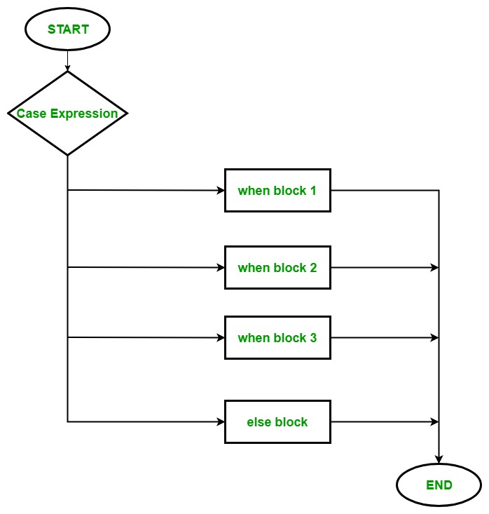

# Ruby case Statement
# Ruby case Statement คืออะไร?
คือการที่เราต้องการตรวจสอบค่าหรือตัวแปรที่กำหนด ว่าตรงตามเงื่อนไขไหน โดยมีหลายเงื่อนไขเเละหลายผลลัพธ์ตามที่กำหนดในเงื่อนไข โดยไม่มีความซับซ้อน ทำให้เกิดผลลัพธ์ได้หลากหลายเเบบ ซึ่งทำหน้าที่เหมือนกับ switch ในภาษา C,Java

**Flow Chart**



**Basic Syntax**

``` ruby
result = case value
   when match1 then result1
   when match2 then result2
   when match3 then result3
   when match4 then result4
   when match5 then result5
   when match6 then result6
   else result7
end
``` 

หรือเเบบนี้ก็ได้เช่นกัน

``` ruby
case expression

when expression 1
  # your code

when expression 2
  # your code
.
.

else
  # your code
end
```
>โดยจะมีส่วนที่สำคัญอยู่ 3 ส่วนคือ 
 >1. case คือ ค่าที่เรากำหนดเพื่อนำเข้าไปในเงื่อนไขเพื่อหาผลลัพธ์ตามค่า โดยอาจเกิด output(ผลลัพธ์) หรือไม่เกิดก็ได้
 >2. when คือ ตัวเงื่อนไขที่จะนำค่า case มาพิจารณาตามเงื่อนไข หากค่า case ตรงตามเงื่อนไขก็จะได้ output ตามที่ตั้งไว้ในเงื่อนไขนั้น 
 >3. else คือ เป็นเงื่อนไขสุดท้าย ที่หากค่า case ถูกตรวจเข้าทุกเงื่อนไขเเล้ว เเต่ไม่ตรงตามเงื่อนไขที่มีเลย ก็ยังจะทำให้ค่า case นั้นยังสามารถเกิด output ได้

**ตัวอย่างที่เป็น String**

โดยที่ case รับค่าเป็น "Patriot" เเล้วนำค่าไปเช็คในเงื่อนไข when 

``` ruby
car = "Patriot"

manufacturer = case car
   when "Focus" then "Ford"
   when "Navigator" then "Lincoln"
   when "Camry" then "Toyota"
   when "Civic" then "Honda"
   when "Patriot" then "Jeep"
   when "Jetta" then "VW"
   when "Ceyene" then "Porsche"
   when "Outback" then "Subaru"
   when "520i" then "BMW"
   when "Tundra" then "Nissan"
   else "Unknown"
end

puts "The " + car  + " is made by "  + manufacturer
```
เมื่อ case เจอกับเงื่อนไขที่ตรงกันก็จะได้ output ออกมาเเล้วจบการทำงาน

<details open>
  <summary><strong>Output</strong></summary>
  <pre><code>
  The Patriot is made by Jeep
</code></pre>
</details>

เเต่หาก case ไม่ตรงกับเงื่อนไขไหนเลย จะได้ output ของเงื่อนไข else เเทนเเล้วจบการทำงาน

<details open>
  <summary><strong>Output</strong></summary>
  <pre><code>
  The Prius is made by Unknown
</code></pre>
</details>

**หรือจะเขียนโดยการใช้ put เเทน then ก็ได้**

โดยในตัวอย่างนี้ case จะรับค่า str ที่เป็น String นำไปตรวจสอบกับ when

``` ruby
print "Input from one, two, three, four: "  

str = "two"
# using case statement
case str 
when "one"  
  puts 'Input is 1'

when "two"  
  puts 'Input is 2'

when "three"  
  puts 'Input is 3'

 when "four"  
  puts 'Input is 4'

else  
  puts "Default!"

end  
```

เมื่อเจอเงื่อนไขที่ตรงกันก็จะได้ output ตามเงื่อนไข เเล้วจบการทำงาน

<details open>
  <summary><strong>Output</strong></summary>
  <pre><code>
  Input from one, two, three, four: Input is 2
</code></pre>
</details>

เเต่หากตรวจครบทุกเงื่อนไข when เเล้ว ก็จะเข้าสู่เงื่อนไข else เเละได้ output เป็น Default! เเล้วค่อยจบการทำงาน

<details open>
  <summary><strong>Output</strong></summary>
  <pre><code>
  Input from one, two, three, four: Default!
</code></pre>
</details>

**ตัวอย่างที่เป็น Number range**

โดยตัวอย่างนี้ ในตัวเงื่อนไขจะเรียกว่า number range หรือ เลขในช่วง ซึ่งค่าที่ case รับมาเป็น Integer เเล้วนำมาตรวจสอบกับเงื่อนไข when ที่เป็น number range โดยการดูว่าเลขที่รับมานั้น อยู่ในช่วงของเลขในเงื่อนไขหรือไม่ 

``` ruby
$age =  5
case $age
when 0 .. 2
   puts "baby"
when 3 .. 6
   puts "little child"
when 7 .. 12
   puts "child"
when 13 .. 18
   puts "youth"
else
   puts "adult"
end
```
case เป็นค่า 5 เมื่อตรวจสอบกับทุกเงื่อนไข when พบว่าเข้ากับเงื่อนไขที่ 2 คือ 3 .. 6(เลขตั้งเเต่ 3-6 รวมเลขท้ายด้วย) จึงได้ output เป็น little child เเล้วจบการทำงาน

<details open>
  <summary><strong>Output</strong></summary>
  <pre><code>
  little child
</code></pre>
</details>

หากเลข case เป็นค่าที่ไม่ตรงกับเงื่อนไขใดเลย ก็จะได้ output ออกมาเป็น adult เเล้วจบการทำงาน

<details open>
  <summary><strong>Output</strong></summary>
  <pre><code>
  adult
</code></pre>
</details>

**ตัวอย่างอีกเเบบที่ใช้ put เเทน then** 

``` ruby
marks = 70

case marks
# using range operators ..
when 0..32
  puts "You fail!"

when 33..40
  puts "You got C grade!"

when 41..60
  puts "You got B grade!"

else
 puts  "You got A grade!"
 
end
```
case เป็นค่า 70 เมื่อตรวจสอบกับทุกเงื่อนไข when พบว่าไม่เข้าเงื่อนไขใดเลย จึงเข้าสู่เงื่อนไขสุดท้าย หรือ else ได้ output เป็น You got A grade! เเล้วจบการทำงาน

<details open>
  <summary><strong>Output</strong></summary>
  <pre><code>
  You got A grade!
</code></pre>
</details>

หากเลข case เป็นค่า 30 เมื่อตรวจสอบกับเงื่อนไข when ที่มี number range เป็น 0..32 ( 0 ถึง 32 โดยรวมค่าสุดท้ายด้วย) ก็จะได้ output ออกมาเป็น You fail! เเล้วจบการทำงาน

<details open>
  <summary><strong>Output</strong></summary>
  <pre><code>
  You fail!
</code></pre>
</details>

### การเปรียบกับภาษาอื่น (C,Java,Python)

**ภาษา Ruby**

``` ruby
grade = 85

case grade
when 90..100
  puts "A"
when 80..89
  puts "B"
when 70..79
  puts "C"
else
  puts "F"
end
```
<details open>
  <summary><strong>Output</strong></summary>
  <pre><code>
  B
</code></pre>
</details>

**ภาษา C**


``` c
int day = 4;

switch (day) {
  case 1:
    printf("Monday");
    break;
  case 2:
    printf("Tuesday");
    break;
  case 3:
    printf("Wednesday");
    break;
  case 4:
    printf("Thursday");
    break;
  case 5:
    printf("Friday");
    break;
  case 6:
    printf("Saturday");
    break;
  case 7:
    printf("Sunday");
    break;
}
```
<details open>
  <summary><strong>Output</strong></summary>
  <pre><code>
  Thursday
</code></pre>
</details>


ข้อเเตกต่างกับ Ruby : 

                   1. ตัวเงื่อนไขใช้ case เเทน when

                   2. ต้องใช้ break ช่วยในการจบการทำงานซึ่ง Ruby ไม่ต้องใช้
                   
                   3. การเเสดงผลใช้ printf เเทน puts
                   

**ภาษา Java**

``` java
int day = 4;
switch (day) {
  case 1:
    System.out.println("Monday");
    break;
  case 2:
    System.out.println("Tuesday");
    break;
  case 3:
    System.out.println("Wednesday");
    break;
  case 4:
    System.out.println("Thursday");
    break;
  case 5:
    System.out.println("Friday");
    break;
  case 6:
    System.out.println("Saturday");
    break;
  case 7:
    System.out.println("Sunday");
    break;
}
```
<details open>
  <summary><strong>Output</strong></summary>
  <pre><code>
  Thursday
</code></pre>
</details>

ข้อเเตกต่างกับ Ruby : 

                   1. ตัวเงื่อนไขใช้ case เเทน when
                   
                   2. ต้องใช้ break ช่วยในการจบการทำงานซึ่ง Ruby ไม่ต้องใช้
                   
                   3. การเเสดงผลใช้ System.out.println เเทน puts
                   

**ภาษา Python**

Python ไม่มี switch case เเต่มีสิ่งที่ใช้เเทนได้คือ if-else(elif) 

```python
bike = 'Yamaha'

if bike == 'Hero':
    print("bike is Hero")

elif bike == "Suzuki":
    print("bike is Suzuki")

elif bike == "Yamaha":
    print("bike is Yamaha")

else:
    print("Please choose correct answer")
```
<details open>
  <summary><strong>Output</strong></summary>
  <pre><code>
  bike is Yamaha
</code></pre>
</details>

หรือถ้าหากเป็น Python 3.10 หรือเวอร์ชั่นหลังจากนี้ จะสามารถใช้ match ที่มีความคล้ายกับ switch ได้
```python
animal = "Eagle"
match animal:
    case "Eagle" | "Parrot":
        print("Bird")
    case "Lion" | "Tiger":
        print("Mammal")
    case "Python" | "Crocodile":
        print("Reptile")
    case _:
        print("Unknown Class")

# Bird
```
<details open>
  <summary><strong>Output</strong></summary>
  <pre><code>
  Bird
</code></pre>
</details>

ข้อเเตกต่างกับ Ruby :

                    1. ตัวเงื่อนไขใช้ if-else,elif เเละ case(วิธี match) เเทน when


                    2. การเเสดงผลใช้ print เเทน puts

### Reference
* [https://www.techotopia.com/index.php/The_Ruby_case_Statement] ตัวอย่างของ Ruby เเละศึกษา syntax
* [https://www.tutorialspoint.com/ruby/ruby_if_else.htm] ตัวอย่างของ Ruby ของ Range 
* [https://www.geeksforgeeks.org/ruby/ruby-case-statement/] ตัวอย่างของ Ruby เเละศึกษา syntax
* [https://www.techotopia.com/index.php/Ruby_Ranges] สำหรับศึกษา number range
* [https://www.tutorialspoint.com/ruby/ruby_ranges.htm] สำหรับศึกษา number range
* [https://www.scaler.com/topics/ruby-switch-statement/] สำหรับการยกตัวอย่างของ Ruby
* [https://www.w3schools.com/c/c_switch.php] สำหรับการยกตัวอย่างของ C
* [https://www.w3schools.com/java/java_switch.asp] สำหรับการยกตัวอย่างของ Java
* [https://www.geeksforgeeks.org/python/switch-case-in-python-replacement/] สำหรับการยกตัวอย่างของ Python เเบบ elif
* [https://www.datacamp.com/tutorial/python-switch-case] สำหรับการยกตัวอย่างของ Python เเบบ match


### Presentation


### Video
