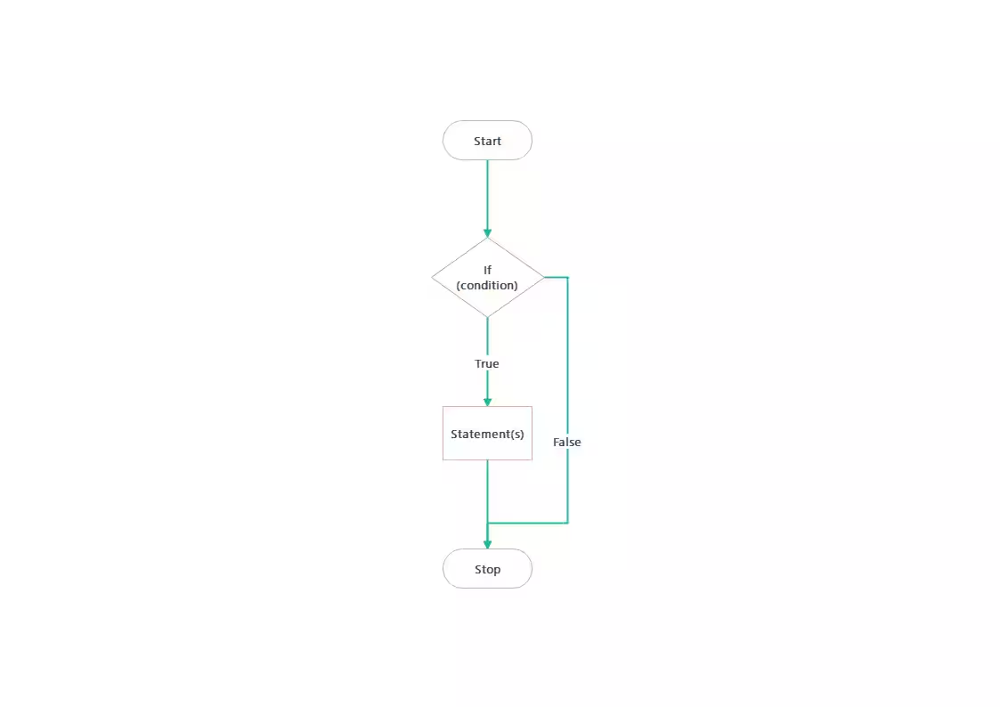

# Ruby if Statement
ในแทบทุกภาษามีคำสั่ง If เป็นรากฐานที่สำคัญของโปรแกรมขนาดใหญ่ และภาษา Ruby ก็เป็นหนึ่งในนั้น

---

## หลักการทำงานของ if statement
ด้วยความที่เป็นคำสั่งพื้นฐานจึงมีรูปแบบการทำงานที่ไม่ซับซ้อนมากนัก if statement จะทำงานตาม "expression" ซึ่งจะมีได้สองค่าได้แก่ true, false
โดยถ้าหากมีค่าเป็น true นั้น จะดำเนินการโปรแกรมด้านในต่อ กลับกันหากเป็น false นั้นก็จะไม่ดำเนินการโปรแกรมด้านใน

---

## Syntax
```Ruby
if expression then
    ruby code
end
```

---

## Flowchart แสดงการทำงานของ if statement


---

## ตัวอย่างการใช้งาน if statement ในภาษา Ruby
```Ruby
if true then
    puts "Your condition is true!"
end

#then is optional (กล่าวคือจะมีหรือไม่มีก็ได้)
```

<details>
<summary>Output</summary>

*Your condition is true!*

**คำอธิบาย:**  
เนื่องจาก `condition` มีค่าเป็น `true`  
โปรแกรมจึงทำงานคำสั่งที่อยู่ด้านในต่อไป  
ทำให้ได้ผลลัพธ์ดังที่เห็น

</details>

---

## ตัวอย่างเพิ่มเติมการใช้งาน if statement
```Ruby
print "Enter your score: "
score = gets.chomp.to_i

if score >= 50
  puts "You passed the exam."
end

if score < 50
  puts "You failed the exam."
end
```
**คำอธิบาย:**
ในตัวอย่างนี้เนื่องจากตัวนี้ผลลัพธ์ขึ้นอยู่กับ Input ที่ผู้ใช้ป้อนเข้าโดยมีเงื่อนไขว่าถ้าหาก score มีค่าตั้งแต่ 50 ขึ้นไปจะแสดงผลคำว่า "You passed the exam." และถ้า score มีค่าต่ำกว่า 50 จะแสดงผลคำว่า "You failed the exam."

---

## เปรียบเทียบกับภาษาอื่น
```Ruby
x = 10
if x > 10
    puts "x is greater than 5"
end
```
```C
#include <stdio.h>
void main(){
    int x = 10;
    if(x>5) {
        printf("x is greater than 5\n");
    }
}
```
```Java
public class Main {
    public static void main(String[] args){
        int x = 10;

        if(x>5) {
            System.out.println("x is greater than 5\n");
        }
    }
}
```
```Python
x = 10
if x > 5:
    print("x is greater than 5")
```
**คำอธิบาย:** โปรแกรมของแต่ละภาษาตัวอย่างมีรูปแบบการทำงานเดียวกันนั่นคือ เมื่อ x มีค่ามากกว่า 5 จะแสดงผลลัพธ์ออกมาเป็นคำว่า "x is greater than 5" ข้อแตกระหว่าง Ruby กับภาษาตัวอย่าง

**C/Java:**
แตกต่างตรงที่มี "()" ครอบเงื่อนไขและมี "{}" ครอบบล็อกคำสั่ง

**Python:**
ไม่ต้องใส่วงเล็บครอบเงื่อนไขเช่นเดียวกับภาษา Ruby แต่มีการใส่ ":" ตามหลังเงื่อนไข และมีใช้การย่อหน้า (indent) บอกขอบเขตการทำงานแทน แต่ไม่จำเป็นต้องใช้ "end" เพื่อระบุการปิดล็อกการทำงาน

---

#### References

* https://docs.ruby-lang.org/en/master/syntax/control_expressions_rdoc.html
* https://www.tutorialspoint.com/ruby/ruby_if_else.html 
* https://actuallyashley.medium.com/understanding-ruby-if-else-statements-c234157e2f5e 
* https://www.w3schools.com/c/c_conditions.php 
* https://www.w3schools.com/java/java_conditions.asp 
* https://www.w3schools.com/python/python_conditions.asp 
