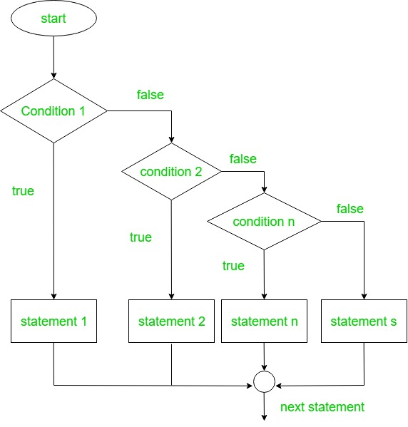

# Using else and elsif Constructs

## Else and elsif Constructs คืออะไร?

คือโครงสร้างควบคุมการไหลที่รองรับเงื่อนไขมากกว่าหนึ่งและต้องใช้คู่กับ `if` ซึ่งมีความคล้ายกับ `case` แต่ `elsif`(else if) จะเหมาะสำหรับ เงื่อนไขที่มีความซับซ้อนและไม่เกี่ยวข้องกันมากกว่า ทำให้สามารถรองรับได้หลายทางเลือก ซึ่ง C, Java และ Python ก็มีเหมือนกัน


**Flowchart**



>ถ้าดูจากรูป แสดงให้เห็นว่าถ้า `condition 1` เป็น **จริง** ก็จะทำ `statement 1` และหลุดออกจาก โครงสร้าง `if...else`  ไปทำ `statement` ต่อไปเลย
>แต่ถ้า `condition 1` **ไม่เป็นจริง** จะไปดู `condition 2` ต่อไปเรื่อยๆเป็นขั้นบันได และถ้าไม่มี `condition` ไหนจริงเลย ก็จะไปทำ `statement` ที่อยู่ใน `else`

<br/><br/>

**Basic Syntax**

```ruby

if condition1

# code to be executed if condition1is true
  
elsif condition2
  
# code to be executed if condition2 is true  

.
.
.

elsif conditionN

# code to be executed if conditionN is true

else

# code to be executed if condition3 is true

end  

```
> มี keyword อยู่ 3 ตัว คือ
>
> 1. if คือ ตัวที่ใช้เพื่อสร้างการตัดสินใจโดยตรวจว่าเงื่อนไขเป็นจริงหรือเท็จ ถ้าเป็นจริง ก็ทำโค้ดข้างใน if แต่ถ้าเป็นเท็จ ก็จะไปดูตัวถัดไป และ if มีได้แค่ตัวเดียวในโครงสร้าง if..else เท่านั้น
> 2. elsif คือ ตัวที่จะมีก็ต่อเมื่อมีเงื่อนไขมากกว่า 1 เงื่อนไข โดยเขียนต่อจาก block ของ if ซึ่งทำงานเหมือนกับ if แต่จะมีอีกกี่ตัวก็ได้ 
> 3. else เป็นเงื่อนไขสุดท้าย เมื่อเงื่อนไขข้างบนไม่มีเงื่อนไขที่ตรงเลย ก็จะทำโค้ดภายใน else

<br/><br/>

หรือจะเขียนอีกแบบคือ ใช้ then แยกระหว่าง เงื่อนไข กับ สิ่งที่ต้องการจะทำเมื่อเงื่อนไขเป็นจริง
```ruby

if condition1 then # code to be executed if condition1is true

elsif condition2 then # code to be executed if condition2 is true  

.
.
.

elsif conditionN then # code to be executed if conditionN is true

else # code to be executed if condition3 is true

end  

```
>ซึ่งจะทำให้โค้ดใช้บันทัดน้อยลง และไม่ได้ไปเปลี่ยนแปลงการทำงานของมัน

<br/><br/>

หรือ สามารถเขียนได้อีก 2 แบบ คือ `One-liner`

```ruby

if condition1 ; statment1 ; elsif condition2 ; statement2 ; else ; statement3 ; end

```
>โค้ดนี้ใช้  ;  (semicolon) เป็น ตัวแยกเงื่อนไขกับการกระทำออกจากกัน

<br/><br/>

หรือ จะใช้ `then` แทน ; (semicolon) ก็ได้ เพื่อเพิ่ม readability

```ruby

if condition1 then statment1 then elsif condition2 then statement2 then else then statement3 ; end

```
<br/><br/>

และ `Nested Ternary`

```ruby

condition1 ? value_if_true : (condition2 ? value_if_true2 : value_if_false2)

```
>ซึ่งวิธีทั้ง 2 ที่กล่าวมาข้างต้นนั้นเป็นวิธีที่**ไม่แนะนำ** ถ้าจะใช้วิธีแบบ `One-liner` สามารถใช้ได้ถ้าทางเลือกไม่เยอะ และเงื่อนไขไม่ซับซ้อน แต่ `Ternary` ไม่ควรใช้เมื่อมีมากกว่า 2 เงื่อนไข เพราะจะทำให้อ่านยากมาก

<br/><br/>

**ตัวอย่าง elsif และ else ที่เป็นตัวเลข**
```ruby
x = 10
y = 100
z = 10

if x == y
  puts "x is equal to y"
elsif x > z
  puts "x is greater than z"
elsif x == z
  puts "x is equal to z"
else
  puts "Something else"
end

```
เมื่อเจอเงื่อนไขที่เป็นจริง ก็จะได้ output ออกมาเป็น
<details>

<summary><strong>Output</strong></summary>

```

x is equal to z

```
</details>
แต่ถ้าไม่มีเงื่อนไขไหนถูกเลยก็จะได้ผลลัพธ์จากใน block else แทน
<details>

<summary><strong>Output</strong></summary>

```

Something else

```
</details>

แล้วถ้ามีเงื่อนไขที่ถูก มากกว่า 1 เงื่อนไขล่ะจะเป็นอย่างไร ไปดูกัน
```ruby
x = 10
y = 100
z = 10

if x == y
  puts "x is equal to y"
elsif x >= z
  puts "x is greater than or equal to z"
elsif x < y
  puts "x is less than y"
else
  puts "Something else"
end

```
จากตัวอย่างจะเห็นว่า ทั้ง 2 elsif นั้นเป็นจริง แต่ถึงอย่างนั้น Ruby จะทำแค่ x >= z เพราะมันถูกตัวแรก และเมื่อทำโค้ดข้างในสำเร็จ ก็จะหลุดจาก โครงสร้าง if...else ไปทำอย่างอื่นต่อถ้ามี
<details>

<summary><strong>Output</strong></summary>

```

x is greater than or equal to z

```
</details>

<br/><br/>

**ตัวอย่างเปรียบเทียบ String**

```ruby
a = 'A'
b = 'B'
c = 'C'

if a > b
 puts "A come after B"
elsif b > c
  puts "B come after C"
elsif b == a
  puts "B come before A"
elsif b > a
  puts "B come after A"
else
  puts "Something else"
end

```
Ruby สามารถเปรียบเทียบ String ได้ โดยดูว่า String ความยาวเท่ากันไหม และ อันไหนเรียงตามตัวอักษรก่อนหลัง โดยใช้ memcmp() เพื่อเปรียบเทียบได้
<details>

<summary><strong>Output</strong></summary>

```

B come after A

```
</details>

<br/><br/>
## การเปรียบกับภาษาอื่น (C,Java,Python)

**ภาษา Ruby**

```ruby

score = 85

if score >= 80
  puts "Distinction"
elsif score >= 60
  puts "First division"
elsif score >= 40
  puts "Second division"
else
  puts "Failed"
end

```

<details>

<summary><strong>Output</strong></summary>

```

Distinction

```
</details>

**ภาษา C**

```c
#include <stdio.h>

int time = 22;
if (time < 10) {
  printf("Good morning.");
} else if (time < 20) {
  printf("Good day.");
} else {
  printf("Good evening.");
}

```

<details>

<summary><strong>Output</strong></summary>

```

Good evening.

```
</details>

>ข้อแตกต่างกับ Ruby:
>
> 1. ใช้คำว่า else if แทน elsif
> 2. else if เป็นการใช้ Nested if ไม่เหมือนกับ elsif ที่เป็นโครงสร้างเดียว
> 3. การเเสดงผลใช้ printf เเทน puts,print
> 4. มีการใช้ braces {} ซึ่ง Ruby ไม่มี
> 5. ไม่มี end เป็นตัวสั่งจบการทำงาน
> 6. ต้องมี parentheses(วงเล็บ) ไว้แยกงื่อนไข และใช้สั่งแสดงผล
> 7. ใช้ ; (semi colon) ในการจบ statement

**ภาษา Java**

```java

class Main {
  public static void main(String[] args) {

    int number = 0;

    // checks if number is greater than 0
    if (number > 0) {
      System.out.println("The number is positive.");
    }

    // checks if number is less than 0
    else if (number < 0) {
      System.out.println("The number is negative.");
    }
    
    // if both condition is false
    else {
      System.out.println("The number is 0.");
    }
  }
}

```
<details>

<summary><strong>Output</strong></summary>

```

The number is 0.

```
</details>

>ข้อแตกต่างกับ Ruby:
>
> 1. ใช้คำว่า else if แทน elsif
> 2. else if เป็นการใช้ Nested if ไม่เหมือนกับ elsif ที่เป็นโครงสร้างเดียว
> 3. การเเสดงผลใช้ System.out.println,System.out.print เเทน puts,print
> 4. มีการใช้ braces {} ซึ่ง Ruby ไม่มี
> 5. ไม่มี end เป็นตัวสั่งจบการทำงาน
> 6. ต้องมี parentheses(วงเล็บ) ไว้แยกงื่อนไข และใช้สั่งแสดงผล
> 7. ใช้ ; (semi colon) ในการจบ statement

**ภาษา Python**

```python

number = 15

if number < 10:
    print("Less than 10")
elif number < 20:
    print("Between 10 and 20")
else:
    print("20 or more")

```

<details>

<summary><strong>Output</strong></summary>

```

Between 10 and 20

```
</details>

>ข้อแตกต่างกับ Ruby:
>
> 1. ใช้คำว่า elif แทน elsif
> 2. มี : เป็นตัวคั่นระหว่างเงื่อนไข กับ สิ่งที่จะทำเมื่อเป็นจริง
> 3. ใช้แค่ print ในการแสดงผล ไม่มี puts
> 4. ไม่มี end เป็นตัวสั่งจบการทำงาน
> 5. ต้องมี parentheses(วงเล็บ) ในการสั่งแสดงผล


https://www.techotopia.com/index.php/Ruby_Flow_Control
https://www.geeksforgeeks.org/ruby/ruby-decision-making-if-if-else-if-else-if-ternary-set-1/
https://github.com/maniramakumar/the-best-ruby-books/blob/master/books/Comprehensive%20Ruby%20Programming.pdf
https://github.com/maniramakumar/the-best-ruby-books/blob/master/books/Beginning%20Ruby%20-%20From%20Novice%20to%20Professional%20-%20Third%20Edition.pdf

https://rosettacode.org/wiki/String_comparison
https://www.techotopia.com/index.php/Ruby_String_Concatenation_and_Comparison

https://www.w3schools.com/c/c_conditions_elseif.php

https://docs.oracle.com/javase/tutorial/java/nutsandbolts/if.html
https://www.programiz.com/java-programming/if-else-statement

https://realpython.com/ref/keywords/elif/
