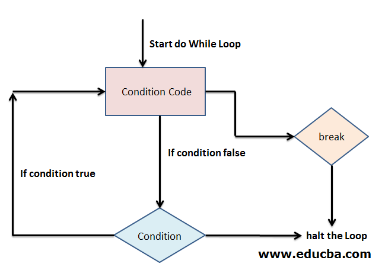

# Breaking from While Loops

## การใช้งาน Break Statement ใน While Loops :

ในภาษา Ruby เราสามารถใช้คำสั่ง `break` เพื่อหยุดการทำงานของ while loop ทันทีก่อนที่จะสิ้นสุดเงื่อนไขการทำงานของ while ในลูป

กล่าวคือ ตามปกติแล้ว while loop จะสิ้นสุดการทำงานเมื่อเงื่อนไขของ while เป็นเท็จ แต่ในบางกรณีที่ต้องการหยุดการทำงานของลูปตามเงื่อนไขบางอย่าง ( if ) สามารถใช้ `break` เพื่อออกจากการทำงานของลูปก่อนที่เงื่อนไขของ while จะเป็นเท็จได้ โดยสามารถดูลำดับการทำงานของคำสั่ง break ได้จาก flow chart&#x20;

## Flow Chart :

<figure><figcaption></figcaption></figure>

## Basic Syntax :

<pre class="language-ruby" data-overflow="wrap" data-full-width="true"><code class="lang-ruby"># Ruby program to use break statement
<strong>while condition 
</strong>    # code
    if condition
        break # using break statement
    end
    # code
end
</code></pre>


การใช้คำสั่ง `break` ใน while loop จะต้องมีการใช้ควบคู่กับคำสั่ง if เสมอ สามารถสังเกตได้จากโค้ดข้างต้นที่มีการกำหนดเงื่อนไขพิเศษเพื่อสิ้นสุดการทำงานของลูป ขณะที่โปรแกรมทำงานวนลูปซ้ำ ๆ แล้วเมื่อใดก็ตามที่เงื่อนไขดั่งกล่าวเป็นจริง คำสั่ง break จะช่วยหยุดการทำงานของลูปทันที


## Example :


```ruby
i = 0
while i < 10
  if i == 3
    break
  end
  puts i
  i += 1
end
```


จากตัวอย่างข้างต้น while loop จะทำงานวนซ้ำทั้งหมด 10 รอบและสิ้นสุดการทำงานเมื่อ i มีค่าน้อยกว่า 10 โดยลูปนี้จะสิ้นสุดการทำงานเมื่อมีการทำงานตรงกับเงื่อนไขพิเศษคือ i มีค่าเท่ากับ 3 เป็นจริง ทำให้ค่าที่ถูกพิมพ์ออกมามีผลลัพธ์ดังนี้

### Output :

```
0
1
2
```

ทั้งนี้ สามารถใช้คำสั่ง `break if` ( การเขียนแบบ inline ) เพื่อกำหนดเงื่อนไขสิ้นสุดการทำงานของลูปได้เช่นกันในกรณีที่เงื่อนไขดังกล่าวไม่ซับซ้อนมากนัก

## Basic Syntax :&#x20;


```ruby
# Ruby program to use break-if statement
while condition 
    # code
    break if condition # using break-if statement
    # code
end
```



เมื่อใช้คำสั่ง `break if` ไม่จำเป็นต้องมี end ปิดท้ายเหมือนการใช้คำสั่ง if แยกกับคำสั่ง `break`


## Example :

<pre class="language-ruby" data-overflow="wrap" data-full-width="true"><code class="lang-ruby">i = 0
while i &#x3C; 10
  puts i
  break if i == 3
  i += 1
<strong>end
</strong></code></pre>



จะเห็นว่าผลลัพธ์ของการทำงานเหมือนกับการใช้คำสั่ง break ปกติ ต่างกันแค่วิธีการเขียนเงื่อนไขให้กระชับมากยิ่งขึ้น


ข้อควรระวัง : ควรตรวจสอบการทำงานของคำสั่ง `break` หากมีการใช้งานคำสั่ง `break` ผิดจุดหรือลืมคำสั่งบางอย่างที่ทำให้ไม่สามารถใช้งานคำสั่ง `break` ได้ อาจทำให้โปรแกรมเกิด infinite loop หรือลูปทำงานไม่รู้จบ


## เปรียบเทียบการใช้ Break ในแต่ละภาษา ( Ruby, C, Java, Python )

## Ruby :

ในภาษา Ruby การใช้คำสั่งเพื่อสิ้นสุดการทำงานของ while loop สามารถใช้ได้ทั้งคำสั่ง `break` และ `break if` โดยถ้าใช้คำสั่ง `break` ปกติจะต้องมีการใช้ควบคู่กับคำสั่ง if ในขณะเดียวกับ `break if` จะเขียนคำสั่งแบบ inline โดยไม่จำเป็นต้องมี end มาปิด

## Example :


```ruby
i = 0
while i < 10
  if i == 3
    break
  end
  puts i
  i += 1
end
```




## C :&#x20;

ในภาษา C การใช้คำสั่ง `break;` จำเป็นจะต้องมีการใช้งานควบคู่กับคำสั่ง if เพื่อให้สามารถสิ้นสุดการทำงานของลูปภายใต้เงื่อนไขดังกล่าวได้ โดยคำสั่ง `break;` จะต้องอยู่ภายใต้บล็อก { } ของเงื่อนไขการสิ้นสุดลูปและมีเครื่องหมาย ; ต่อท้ายเสมอ

```c
while(condition){
    if(condition){
        break; // using break statement
    }
}
```

## Example :

```c
int i = 0;
while(i<10) {
    if(i==3) {
        break;
    }
    printf("%d\n", i);
    i+=1;
}
```



## Python :

ในภาษา Python สามารถใช้คำสั่ง `break` ได้หลังจากที่กำหนดเงื่อนไขในการสิ้นสุดการทำงานของลูปแล้ว โดยไม่จำเป็นต้องมี ; ปิดอยู่ด้านหลัง โดยภาษา Python จะใช้ตัว indentation ในการกำหนดขอบเขตของ

## Basic Syntax :

```python
while condition:
    if condition:
        break # using break statement
```

## Example :


```python
i = 0
while i < 10:
    if i == 3:
        break
    print(i)
    i += 1
```




## Java :

ในภาษา Java การเรียกใช้คำสั่ง `break;` มีความคล้ายคลึงกับภาษา C คือ ต้องใช้งานคำสั่ง break; ควบคู่กับคำสั่ง if โดยจะต้องเรียกใช้ `break;` ภายใต้บล็อก { } ของเงื่อนไขการสิ้นสุดลูปและมีเครื่องหมาย ; ปิดท้ายเสมอ

## Basic Syntax :&#x20;

```java
while(condition) {
    if(condition){
        break; // using break statement
    }
}
```

## Example :

```java
public class Main {
    public static void main(String[] args) {
        int i = 0;
        while (i < 10) {
            if (i == 3) {
                break;
            }
            System.out.println(i);
            i++;
        }
    }
}
```




## ลักษณะเด่นของคำสั่ง break ในภาษา Java อีกหนึ่งอย่างที่แตกต่างจากภาษาอื่นคือ เราสามารถใช้งาน labeled break เพื่อออกจากการทำงานของลูปซ้อนหลายชั้นได้

อธิบายเพิ่มเติม : `labeled break` เป็นฟีเจอร์ในภาษา Java ที่เราสามารถตั้งชื่อ ( หรือเรียกว่าการ label ) ให้กับลูปได้ แล้วมีการใช้คำสั่ง break เพื่อออกจากการทำงานของลูปดังกล่าวที่มีการระบุชื่อไว้ สามารถใช้งานได้ในกรณีที่ต้องการกระโดดออกจากลูปที่ซ้อนกันหลายชั้น


## Basic Syntax :

#### ตัวอย่าง syntax การใช้ labeled break กับลูปชั้นเดียว

```java
labelName:
while (condition) {
    break labelName; // using labeled break statement
}
```

#### ตัวอย่าง syntax การใช้งาน labeled break กับลูปซ้อนกันหลายชั้น

```java
labelName:
while (condition) {
    while (condition) {
        break labelName; // using labeled break statement
    }
}
```

## Example :


```java
public class JavaLabeledLoopEx 
{
   public static void main(String[] args) 
   {
      int outerCount = 0;
      outerLoop:
         while (outerCount < 3) 
         {
            int innerCount = 0;
            while (innerCount < 3) 
            {
               System.out.println("Outer Count: " + outerCount + ", Inner Count: " + innerCount);
               if (outerCount == 1 && innerCount == 1) 
               {
                  break outerLoop; // using labeled break statement
               }
               innerCount++;
            }
            outerCount++;
         }
   }
}
```


### Output

```
Outer Count: 0, Inner Count: 0
Outer Count: 0, Inner Count: 1
Outer Count: 0, Inner Count: 2
Outer Count: 1, Inner Count: 0
Outer Count: 1, Inner Count: 1
```

จากตัวอย่างโค้ดข้างต้น จะหยุดการทำงานของลูปที่มี label เป็น outerLoop เมื่อมีการเข้าเงื่อนไข if ( outerCount == 1 && innerCount == 1 ) โดยคำสั่ง `break` จะทำให้การทำงานของลูปชั้นนอกสิ้นสุดลงและไม่มีการวนซ้ำของลูปชั้นในและลูปชั้นนอกแม้ว่าจะยังทำงานไม่ถึงจุดที่ค่าของ while เป็น false ( while (innerCount < 3) , while (outerCount < 3) ) โดยจะได้ผลลัพธ์ของการทำงานดังนี้


ในภาษา Java และภาษา C สามารถใช้งานคำสั่ง `break`ควบคู่กับคำสั่ง `switch-case` ได้แทนการใช้งานคำสั่ง if


#### Java Example :


```java
inputLoop: while(scanner.hasNextInt()){
    int userInput = scanner.nextInt();
    switch(userInput){
        case 0:
            break inputLoop;
        case 1:
            System.out.println("You chose 1");
            break;
        case 2:
            System.out.println("You chose 2");
            break;
        default:
            System.out.println("No such choice");
    }
}
```


จากโค้ดภาษา Java ข้างต้น การทำงานจะสิ้นสุดเมื่อเข้าเงื่อนไขเคสที่ userInput มีค่าเท่ากับ 0 หรือ case 0 ( userInput = 0 ) ซึ่งสามารถใช้งานเป็น `labeled break` ได้เพื่อหยุดการทำงานของลูปชั้นที่ label ไว้ ซึ่งในที่นี้ถ้ามีการใช้คำสั่ง break inputLoop จะทำให้สิ้นสุดการทำงานทั้งหมดภายใต้ลูปดังกล่าว ต่างจากการใช้งาน break ปกติที่จะหยุดการทำงานแค่ใน switch เท่านั้น

#### C Example :

```c
int ch;
printf("Enter 4 to exit\n");
while((ch=getchar())!=4) {
    switch(ch) {
    case 1:
        printf("Inside the case 1\n");
        break;
    case 2:
        printf("Inside the case 2\n");
        break;
    case 3:
        printf("Inside the case 3\n");
        break;
    default:
        printf("You entered %d but still inside the switch\n",ch);
    }
    printf("Enter 4 to exit\n");
}
printf("Out of While loop\n");
```

จากโค้ดข้างต้นเป็นการรับอักขระเข้ามาแบบวนซ้ำและจะสิ้นสุดการทำงานเมื่อเปรียบเทียบกับเงื่อนไขพิเศษคือ while((ch=getchar())!=4) เมื่อใดก็ตามที่ input อักขระที่รับเข้ามามีค่า ASCII เท่ากับ 4 หรือตรงกับเงื่อนไข default จะสิ้นสุดการทำงานของลูป while โดยทันที

## Slide :


## Presentation Video :


## Reference :

### Ruby

Priya Pedamkar. (2023). How Break Statement Works in Ruby?. _Break in Ruby._ \[online]. สืบค้นเมื่อ 4 กันยายน พ.ศ.2568 จาก [https://www.educba.com/break-in-ruby/](https://www.educba.com/break-in-ruby/)

Jan Bodnar. (2025). Basic break in while Loop. _Ruby break Keyword._ \[online]. สืบค้นเมื่อ 4 กันยายน พ.ศ.2568 จาก [https://zetcode.com/ruby/break-keyword/](https://zetcode.com/ruby/break-keyword/)

Programiz. (ไม่มีวันที่). Working of Ruby break Statement. _Ruby break And next Statements._ \[online]. สืบค้นเมื่อ 4 กันยายน พ.ศ.2568 จาก [https://www.programiz.com/ruby/break-next](https://www.programiz.com/ruby/break-next)

usefulcodes. (2025). Examples of Using Control Statements. _Ruby Loop Control Statements._ \[online] สืบค้นเมื่อ 4 กันยายน พ.ศ.2568 จาก [https://useful.codes/ruby-loop-control-statements/](https://useful.codes/ruby-loop-control-statements/)

### C

Bala Priya C. (2021). How to Use break to Exit Loops in C. _C Break and Continue Statements – Loop Control Statements in C Explained._ \[online]. สืบค้นเมื่อ 4 กันยายน พ.ศ.2568 จาก [https://www.freecodecamp.org/news/c-break-and-continue-statements-loop-control-statements-in-c-explained/](https://www.freecodecamp.org/news/c-break-and-continue-statements-loop-control-statements-in-c-explained/)

Benjamin Walker. (2024). Break Statement in C. _Loops in C: For, While, Do While looping Statements \[Examples]_. \[online]. สืบค้นเมื่อ 4 กันยายน พ.ศ.2568 จาก [https://www.guru99.com/c-loop-statement.html](https://www.guru99.com/c-loop-statement.html)

### Python

TutorialKart. (ไม่มีวันที่). Python – While Loop with Break Statement. _Break While Loop in Python_. \[online]. สืบค้นเมื่อ 4 กันยายน พ.ศ.2568 จาก [https://www.tutorialkart.com/python/python-while-loop/python-while-loop-break/](https://www.tutorialkart.com/python/python-while-loop/python-while-loop-break/)

note.nkmk. (2023). Basic syntax of while loops in Python. _Python while Loop (Infinite Loop, break, continue)_. \[online]. สืบค้นเมื่อ 4 กันยายน พ.ศ 2658 จาก [https://note.nkmk.me/en/python-while-usage/](https://note.nkmk.me/en/python-while-usage/)

### Java

Mohammad Irfan. (2024). Exit a while Loop by Using break in Java. _How to Exit a While Loop in Java_. \[online]. สืบค้นเมื่อ 4 กันยายน พ.ศ 2658 จาก [https://www.delftstack.com/howto/java/exit-while-loop-in-java/](https://www.delftstack.com/howto/java/exit-while-loop-in-java/)

Softwaretestingo Editorial Board. (2024). Java Labeled while Loop. _Labeled Loop in Java_. \[online]. สืบค้นเมื่อ 4 กันยายน พ.ศ 2658 จาก [https://www.softwaretestingo.com/labeled-loop-in-java/](https://www.softwaretestingo.com/labeled-loop-in-java/)

codelucky. (2024). Using Break in Different Loop Types. _Java Break: Exiting Loops Early_. \[online]. สืบค้นเมื่อ 4 กันยายน พ.ศ 2658 จาก [https://codelucky.com/java-break/](https://codelucky.com/java-break/)

Andrii Piatakha. (2024). _Breaking out of a While Loop in Java Switch Statement._ \[online]. สืบค้นเมื่อ 4 กันยายน พ.ศ 2658 จาก [https://learn-it-university.com/breaking-out-of-a-while-loop-in-java-switch-statement/](https://learn-it-university.com/breaking-out-of-a-while-loop-in-java-switch-statement/)

